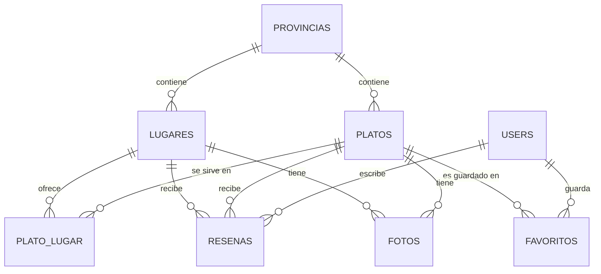
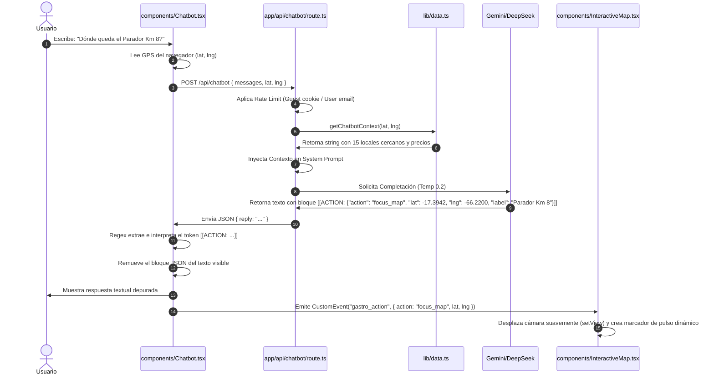
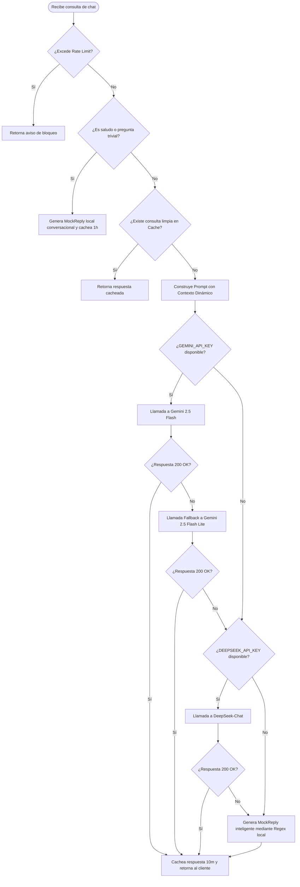
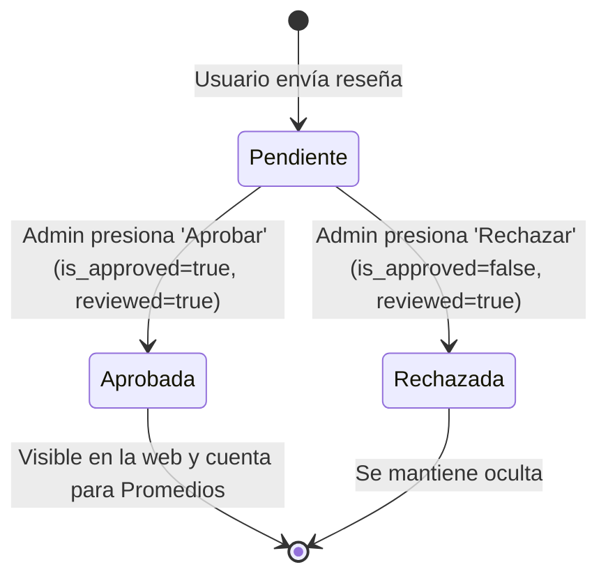

# DOCUMENTACIÓN TÉCNICA SISTÉMICA DE LA PLATAFORMA GASTROCOCHA

## 1. IDENTIFICACIÓN GENERAL DEL PROYECTO

### 1.1. Nombre del Proyecto
**GastroCocha** (Plataforma digital integrada de guía gastronómica y turística orientada a geolocalización y asistencia interactiva inteligente).

### 1.2. Problema que Resuelve
La descentralización y asimetría de información referente a la oferta gastronómica y patrimonial en el departamento de Cochabamba, Bolivia. Históricamente, la promoción de establecimientos y platos típicos se concentra en el área metropolitana (Cercado), dejando invisibilizada la riqueza culinaria de las restantes 15 provincias. GastroCocha unifica esta información y mitiga la falta de visibilidad comercial para pequeñas y medianas empresas (pymes) de zonas suburbanas y rurales.

### 1.3. Contexto Cultural y Empresarial
Cochabamba es reconocida constitucionalmente como la "Capital Gastronómica de Bolivia". Su territorio se divide en 16 provincias: *Cercado, Quillacollo, Chapare, Punata, Germán Jordán (Cliza), Esteban Arce (Tarata), Arani, Carrasco (Totora), Mizque, Capinota, Campero (Aiquile), Ayopaya (Independencia), Arque, Tapacarí, Bolívar y Tiraque*. La plataforma fomenta el turismo regional e impulsa el desarrollo de economías locales de carretera (pensiones y chicherías tradicionales) al conectar a usuarios urbanos y viajeros con platos emblemáticos directamente asociados a su origen geográfico.

### 1.4. Arquitectura Tecnológica
Arquitectura Full-Stack desacoplada de alto rendimiento basada en:
*   **Framework Principal**: Next.js (App Router, React 19, TailwindCSS para estilos, TypeScript).
*   **Base de Datos**: Supabase (PostgreSQL 15+) operando como *Database as a Service* (DBaaS) con acceso mediante cliente del lado del servidor (Service Role Client para operaciones administrativas directas).
*   **Asistente Inteligente**: Asistente virtual contextualizado (*Context-Aware AI Assistant*) capaz de generar e inyectar porciones de base de datos directamente en el prompt del LLM, implementando un mecanismo de tolerancia a fallos multi-proveedor y parseo de eventos de interfaz gráfica en tiempo real.

### 1.5. Objetivos del Sistema
*   **Objetivo Principal**: Centralizar la oferta culinaria y la información patrimonial de las 16 provincias de Cochabamba a través de un portal web interactivo georreferenciado y un asistente conversacional automatizado de respuesta inmediata.
*   **Objetivos Secundarios**:
    1.  Proveer geolocalización en tiempo real para guiar al usuario hacia establecimientos cercanos calculando distancias de forma matemática en el cliente y en el servidor.
    2.  Habilitar un panel administrativo centralizado que permita moderar las reseñas emitidas por los comensales y procesar registros públicos de nuevos establecimientos de forma segura.
    3.  Proveer a los propietarios de negocios (`owner`) un panel autogestionable para actualizar sus menús, precios y platos sin requerir intervención técnica directa.

### 1.6. Problemática Detallada
*   **Tecnológica y UX**: La navegación turística convencional carece de interacción inteligente. GastroCocha soluciona esto integrando un mapa dinámico (Leaflet) que reacciona de forma reactiva a comandos conversacionales del chatbot (UI Actions) sin recargar la página.
*   **Operativa y Comercial**: La proliferación de reseñas falsas o abusivas y los registros informales requieren un flujo de moderación estricto donde cada reseña o establecimiento nuevo permanezca en un estado de aprobación pendiente (`is_approved = false` / `status = 'pendiente'`) hasta su verificación manual.
*   **Gestión de Datos**: Relación relacional muchos a muchos (N:M) entre platos y restaurantes mediante una tabla pivote que maneja precios específicos y marcas de especialidad de la casa, combinado con georreferenciación espacial simplificada mediante coordenadas decimales.

---

## 2. DESCRIPCIÓN GENERAL DEL SISTEMA

El sistema modela y gestiona el flujo de información de las siguientes entidades:

### 2.1. Entidades Involucradas



1.  **Provincias (`provincias`)**: Representa las divisiones políticas del departamento. Almacena: `nombre`, `slug` (identificador URL), `descripcion`, `centro_lat` (latitud central para enfocar mapa), `centro_lng` (longitud central) y `zoom_mapa`.
2.  **Usuarios (`users`)**: Personas con acceso al sistema. Roles: `user` (comensal regular), `admin` (administrador general) y `owner` (dueño de negocio). Almacena: `name`, `email`, `password_hash` y `role`.
3.  **Platos (`platos`)**: Catálogo patrimonial de recetas tradicionales. Almacena: `nombre`, `slug`, `descripcion`, `historia`, `ingredientes`, `precio_referencial`, `destacado` (booleano), `activo` (booleano), `promedio_rating` (cálculo de reseñas), `total_resenas` e `imagen_url`.
4.  **Lugares / Establecimientos (`lugares`)**: Restaurantes o pensiones donde se consume la gastronomía. Almacena: `nombre`, `slug`, `direccion`, `referencia`, `telefono`, `sitio_web`, `lat`, `lng` (coordenadas GPS), `activo`, `aprobado` (moderación), `contacto_propietario`, `nombre_propietario`, `email_propietario` (para enlace con la cuenta `owner`), `descripcion`, `imagen_url` y `especialidades` (objeto JSONB para guardar platos específicos del negocio que no pertenecen al catálogo patrimonial).
5.  **Plato_Lugar (`plato_lugar`)**: Tabla asociativa N:M. Almacena: `plato_id`, `lugar_id`, `precio_aproximado` (específico de ese restaurante) y `especialidad` (indica si es el plato estrella del restaurante).
6.  **Reseñas (`resenas`)**: Calificaciones de 1 a 5 estrellas con comentarios escritos. Aplica a un plato, un restaurante, o a una especialidad libre. Almacena: `user_id`, `plato_id`, `lugar_id`, `rating`, `titulo`, `comentario`, `fecha_visita`, `is_approved` (moderación de spam), `reviewed` (si fue auditado por admin) y `especialidad_nombre` (cadena para platos personalizados).
7.  **Favoritos (`favoritos`)**: Colección personal de platos de un usuario. Relaciona `user_id` y `plato_id`.
8.  **App Settings (`app_settings`)**: Tabla clave-valor para configuraciones globales editables en base de datos. Guarda estados como `registro_publico_habilitado` y `chatbot_habilitado`.
9.  **Solicitudes (`solicitudes`)**: Tabla intermedia para el autoregistro público de locales de carretera y pymes. Almacena información idéntica a `lugares` más una lista de platos servidos y especialidades en texto libre, y el estado de la solicitud (`pendiente`, `aprobado`, `rechazado`).

### 2.2. Flujo de Datos del Sistema

```
[ Entrada del Usuario ]
  ├── GPS del Comensal (lat, lng)
  ├── Filtro de Presupuesto (Bs)
  └── Mensaje Conversacional (Chatbot)
           │
           ▼
[ Capa de Procesamiento (Next.js Edge/Server) ]
  ├── Cálculo de Cercanía (Fórmula de Haversine)
  ├── Serialización de Base de Datos para Prompt (Context Ingestion)
  └── Evaluación de Proveedores LLM (Gemini 2.5 Flash -> Flash Lite -> DeepSeek -> Regex)
           │
           ▼
[ Mutación del Estado del Sistema ]
  ├── Intercepción y Parseo de UI Actions (JSON Token: [[ACTION: ...]])
  ├── Control de Rate-Limits (IP / Cookies de Sesión / Email de Usuario)
  └── Aprobación/Rechazo en Tablas de Moderación ('solicitudes' y 'resenas')
           │
           ▼
[ Salidas Interactivas (Cliente/UI) ]
  ├── Centrado de Cámara del Mapa Leaflet en Tiempo Real (focus_map)
  ├── Redirección de Rutas (navigate)
  ├── Rellenado Automático de Formulario de Registro (fill_form)
  └── Despliegue de Reseñas Pre-aprobadas e Indicadores de Calor (Hot Score)
```

---

## 3. ARQUITECTURA DEL SOFTWARE

Estructura modular del proyecto en la carpeta `gastro-next/`:

```
gastro-next/
├── app/                           # App Router (Next.js 16)
│   ├── admin/                     # Módulos de Administración General
│   │   ├── layout.tsx             # Layout del dashboard con barra lateral
│   │   ├── page.tsx               # Panel principal con contadores y KPI
│   │   ├── lugares/               # Gestión de establecimientos
│   │   ├── platos/                # Gestión del catálogo de platos
│   │   ├── propietarios/          # Registro y claves para dueños de locales
│   │   └── solicitudes/           # Bandeja de entrada de registros públicos
│   ├── api/                       # Endpoints HTTP (API Routes)
│   │   ├── admin/                 # Rutas protegidas para administración
│   │   ├── auth/                  # Endpoints de autenticación (custom HMAC)
│   │   ├── chatbot/               # Orquestación de IA y fallbacks
│   │   ├── map/                   # Endpoints de geolocalización y GIS
│   │   ├── owner/                 # Acciones de propietarios de locales
│   │   └── solicitudes/           # Creación pública de solicitudes
│   ├── plato/                     # Páginas dinámicas de platos patrimoniales
│   ├── provincia/                 # Páginas dinámicas de las provincias
│   ├── ranking/                   # Ranking dinámico e histórico de platos
│   ├── registrar-negocio/         # Formulario público de registro
│   ├── layout.tsx                 # Envoltura global de HTML
│   └── page.tsx                   # Página de bienvenida / Buscador
├── components/                    # Componentes React Interactivos
│   ├── Chatbot.tsx                # Panel de IA, Rate limit y parser de acciones
│   ├── InteractiveMap.tsx         # Mapa interactivo Leaflet (CSR)
│   ├── MapWrapper.tsx             # Cargador dinámico sin SSR para Leaflet
│   └── PlatoCard.tsx              # Tarjeta de renderizado de plato
├── lib/                           # Capa de Lógica de Negocio y Conectores
│   ├── auth.ts                    # Cifrado SHA-256, firma HMAC y sesiones
│   ├── data.ts                    # Métodos CRUD de acceso a Supabase
│   ├── schema.ts                  # Esquema SQL en formato String para referencia
│   ├── supabase.ts                # Inicialización del cliente Supabase
│   ├── types.ts                   # Interfaces TypeScript del dominio
│   └── utils.ts                   # Fórmulas matemáticas, formateadores y hashes
└── supabase-setup.sql             # Script SQL de inicialización de la base de datos
```

### 3.1. Responsabilidad de Archivos Clave

*   **`lib/auth.ts`**: Implementa criptografía local. Genera una firma HMAC-SHA256 para firmar un token de sesión serializado en Base64, el cual se escribe en la cookie `gastro_session`. Contiene funciones para validar contraseñas usando SHA-256 con sal fija (`'gastro-cocha-salt'`), registrar cuentas de comensales y propietarios, y validar roles de administrador.
*   **`lib/data.ts`**: Encapsula todas las llamadas a Supabase utilizando la función `getServiceSupabase` para evitar limitaciones de permisos en operaciones críticas. Maneja el mapeo estricto de tipos PostgreSQL a las interfaces TypeScript. Contiene la lógica compleja del ranking general (platos patrimoniales más especialidades libres) y la lógica del ordenamiento por tendencias utilizando el algoritmo de decaimiento temporal (Hot Score).
*   **`app/api/chatbot/route.ts`**: Controlador central del chatbot. Realiza el control de tasa de consumo (Rate Limit) evaluando cookies de invitados (máximo 10 peticiones diarias) y límites de usuarios registrados (máximo 50 peticiones diarias en memoria), intercepta saludos y preguntas frecuentes mediante expresiones regulares para ahorrar tokens, concatena el prompt de sistema enriquecido con la base de datos serializada y orquesta la consulta HTTP hacia Gemini 2.5 Flash, implementando fallback hacia Gemini 2.5 Flash Lite y DeepSeek API en caso de fallas de conexión o sobrecarga de API (errores 503/429).
*   **`components/Chatbot.tsx`**: Componente cliente. Gestiona la visibilidad del panel, almacena el historial local del chat, solicita coordenadas GPS mediante `navigator.geolocation` y las almacena en estado. Al recibir la respuesta del servidor, aplica una expresión regular para detectar y extraer el bloque `[[ACTION: JSON]]`, emitiendo un evento personalizado `gastro_action` o llamando a `router.push`.
*   **`components/InteractiveMap.tsx`**: Inicializa la instancia del mapa Leaflet y añade capas de CartoDB de forma interactiva. Escucha el evento global `gastro_action` de tipo `"focus_map"` para enfocar la cámara mediante coordenadas. Implementa la función `handleGeolocation` para calcular, a través de la fórmula de Haversine en el cliente, cuáles son los 5 restaurantes más cercanos a la coordenada actual del usuario, presentándolos en un popup informativo del mapa con opción de ruteo externo.
*   **`lib/utils.ts`**: Centraliza funciones utilitarias libres de dependencias de Base de Datos. Destaca la función `haversine` para calcular distancias esféricas terrestres y `isWithinCochabamba` que restringe el funcionamiento del GPS dentro de los límites espaciales geográficos del departamento.

---

## 4. EXPLICACIÓN COMPLETA DEL FLUJO DE EJECUCIÓN

### 4.1. Ciclo de Vida del Renderizado Inicial
1.  **Carga del Servidor (SSR)**: Al acceder a la página de inicio (`app/page.tsx`), Next.js renderiza los elementos estructurales y ejecuta consultas en el servidor para obtener platos destacados y provincias disponibles mediante `getPlatosDestacados()` y `getAllProvincias()`.
2.  **Carga del Cliente (CSR)**: El mapa interactivo se importa mediante un cargador dinámico con `ssr: false` (`components/MapWrapper.tsx`) debido a que la librería Leaflet requiere acceso directo al objeto global `window` del navegador.

### 4.2. Geolocalización y Búsqueda Espacial
1.  El usuario presiona el botón "Usar mi ubicación GPS" en la interfaz del mapa.
2.  El componente ejecuta `navigator.geolocation.getCurrentPosition`.
3.  Se obtienen la latitud y longitud. El sistema valida si las coordenadas caen dentro de la caja de Cochabamba mediante la función `isWithinCochabamba(lat, lng)`.
    *   *Si es falso*: Muestra una alerta en pantalla indicando que el usuario está fuera de rango geográfico y centra el mapa en las coordenadas de referencia del Cercado (-17.3895, -66.1568).
    *   *Si es verdadero*: Envía las coordenadas al endpoint `/api/map/provincia-por-coordenadas?lat=...&lng=...`. El servidor evalúa mediante cálculo euclidiano cuál es la provincia más cercana a sus coordenadas en base a los centros definidos en la tabla `provincias`.
4.  El cliente recibe la provincia detectada (ej. Quillacollo) y actualiza automáticamente el selector.
5.  Se calcula la distancia esférica terrestre a todos los restaurantes aprobados de dicha provincia en el cliente utilizando la fórmula de Haversine y se abre un popup que lista los 5 locales más cercanos ordenados de menor a mayor distancia.

### 4.3. Ciclo de Consulta del Chatbot y Ejecución de Acciones
El siguiente diagrama detalla el flujo de una consulta enviada al chatbot:



---

## 5. MODELO MATEMÁTICO Y DE DATOS DEL SISTEMA

### 5.1. Fórmulas Matemáticas Implementadas

#### A. Fórmula de Haversine (Distancia Terrestre Esférica)
Implementada en `lib/utils.ts` y duplicada en `components/InteractiveMap.tsx` para calcular la distancia en kilómetros entre dos coordenadas geográficas sobre la superficie de la Tierra (asumiendo una esfera perfecta).

$$\Delta \text{lat} = \text{toRad}(\text{lat}_2 - \text{lat}_1)$$

$$\Delta \text{lng} = \text{toRad}(\text{lng}_2 - \text{lng}_1)$$

$$a = \sin^2\left(\frac{\Delta \text{lat}}{2}\right) + \cos(\text{toRad}(\text{lat}_1)) \cdot \cos(\text{toRad}(\text{lat}_2)) \cdot \sin^2\left(\frac{\Delta \text{lng}}{2}\right)$$

$$c = 2 \cdot \arctan2\left(\sqrt{a}, \sqrt{1 - a}\right)$$

$$d = R \cdot c$$

Donde:
*   $R = 6371$ km (Radio medio de la Tierra).
*   $\text{toRad}(\alpha) = \alpha \cdot \frac{\pi}{180}$ (Conversión de grados sexagesimales a radianes).
*   $d$: Distancia final en kilómetros.

#### B. Algoritmo de Ranking por Tendencias (Hot Score con Decaimiento Temporal)
Implementado en `lib/data.ts` (`getTrendingGlobal`) para calificar la popularidad de los platos basándose en la recencia y valoración de sus reseñas en una ventana móvil de 45 días respecto a la fecha fija de evaluación de base de datos ($T_{\text{ref}} = \text{2026-06-24T12:00:00Z}$).

Para cada reseña $r$ aprobada de un plato:
1.  Calcula la diferencia de días entre la fecha de referencia y la fecha de visita de la reseña:
    $$\Delta t = \frac{T_{\text{ref}} - T_{\text{visita}}}{1000 \cdot 60 \cdot 60 \cdot 24}$$
2.  Determina el peso de la reseña ($w$) según el intervalo temporal:
    $$w = \begin{cases} 
      1.0 & \text{si } 0 \le \Delta t \le 15 \text{ días} \\
      0.3 & \text{si } 15 < \Delta t \le 45 \text{ días} \\
      0.0 & \text{si } \Delta t > 45 \text{ días o } \Delta t < 0
   \end{cases}$$
3.  Calcula el puntaje acumulado (*Hot Score*):
    $$\text{Hot Score} = \sum_{r} (\text{rating}_r \cdot w)$$

Este modelo penaliza severamente las reseñas antiguas para garantizar que el listado "En Tendencia" represente la actividad reciente de consumo de los locales.

#### C. Algoritmo de Hashing Criptográfico (SHA-256 con Sal Fija)
Implementado en `lib/utils.ts` (`simpleHash`) y en `lib/auth.ts` (`hashPassword`) para el almacenamiento seguro de credenciales.

$$\text{Password Hash} = \text{SHA-256}(\text{Password Plain} + \text{"gastro-cocha-salt"})$$

Implementado en el cliente vía Web Crypto API (`crypto.subtle.digest`) y en el backend mediante el módulo nativo de Node.js `crypto`.

#### D. Lógica Euclidiana de Detección de Provincia Cercana
Cuando el usuario activa el GPS, el servidor resuelve a qué provincia corresponde mediante la distancia euclidiana simplificada respecto al baricentro o centro geográfico registrado de cada provincia en la base de datos (puesto que el espacio geográfico provincial es acotado).

$$\text{Distancia}^2 = (\text{lat}_{\text{usuario}} - \text{centro\_lat}_p)^2 + (\text{lng}_{\text{usuario}} - \text{centro\_lng}_p)^2$$

Se selecciona la provincia $p$ que minimice la distancia al cuadrado.

---

### 5.2. Estructura de la Base de Datos Relacional (Supabase / PostgreSQL)

A continuación se detalla el esquema lógico de las tablas creadas por el archivo `supabase-setup.sql`:

#### Tabla: `provincias`
*   `id`: `BIGSERIAL` (Llave primaria).
*   `nombre`: `VARCHAR(100) NOT NULL`.
*   `slug`: `VARCHAR(120) UNIQUE NOT NULL` (Índice único implícito).
*   `descripcion`: `TEXT` (Acepta nulo).
*   `centro_lat`: `DECIMAL(10,8)` (Latitud geográfica central).
*   `centro_lng`: `DECIMAL(11,8)` (Longitud geográfica central).
*   `zoom_mapa`: `SMALLINT` (Nivel de acercamiento inicial de Leaflet).
*   `created_at`: `TIMESTAMPTZ DEFAULT NOW()`.
*   `updated_at`: `TIMESTAMPTZ DEFAULT NOW()`.

#### Tabla: `users`
*   `id`: `BIGSERIAL` (Llave primaria).
*   `name`: `VARCHAR(255) NOT NULL`.
*   `email`: `VARCHAR(255) UNIQUE NOT NULL`.
*   `password_hash`: `VARCHAR(255) NOT NULL`.
*   `role`: `VARCHAR(20) DEFAULT 'user'`.
    *   *Constraint*: `CHECK (role IN ('user', 'admin', 'owner'))`.
*   `created_at`: `TIMESTAMPTZ DEFAULT NOW()`.
*   `updated_at`: `TIMESTAMPTZ DEFAULT NOW()`.

#### Tabla: `platos`
*   `id`: `BIGSERIAL` (Llave primaria).
*   `provincia_id`: `BIGINT NOT NULL`.
    *   *Llave Foránea*: `REFERENCES provincias(id) ON DELETE RESTRICT`.
*   `nombre`: `VARCHAR(150) NOT NULL`.
*   `slug`: `VARCHAR(180) UNIQUE NOT NULL`.
*   `descripcion`: `TEXT NOT NULL`.
*   `historia`: `TEXT`.
*   `ingredientes`: `TEXT`.
*   `precio_referencial`: `DECIMAL(8,2)`.
*   `destacado`: `BOOLEAN DEFAULT FALSE`.
*   `activo`: `BOOLEAN DEFAULT TRUE`.
*   `promedio_rating`: `DECIMAL(3,2)`.
*   `total_resenas`: `INT DEFAULT 0`.
*   `imagen_url`: `TEXT`.
*   `created_at`: `TIMESTAMPTZ DEFAULT NOW()`.
*   `updated_at`: `TIMESTAMPTZ DEFAULT NOW()`.

#### Tabla: `lugares`
*   `id`: `BIGSERIAL` (Llave primaria).
*   `provincia_id`: `BIGINT NOT NULL`.
    *   *Llave Foránea*: `REFERENCES provincias(id) ON DELETE RESTRICT`.
*   `nombre`: `VARCHAR(150) NOT NULL`.
*   `slug`: `VARCHAR(180) UNIQUE NOT NULL`.
*   `direccion`: `VARCHAR(255)`.
*   `referencia`: `VARCHAR(255)`.
*   `telefono`: `VARCHAR(50)`.
*   `sitio_web`: `VARCHAR(255)`.
*   `lat`: `DECIMAL(10,8) NOT NULL`.
*   `lng`: `DECIMAL(11,8) NOT NULL`.
*   `activo`: `BOOLEAN DEFAULT TRUE`.
*   `aprobado`: `BOOLEAN DEFAULT FALSE` (Flag de moderación).
*   `contacto_propietario`: `VARCHAR(100)`.
*   `nombre_propietario`: `VARCHAR(150)`.
*   `email_propietario`: `VARCHAR(255)` (Permite asociar la sucursal física al rol `owner`).
*   `descripcion`: `TEXT`.
*   `imagen_url`: `TEXT`.
*   `especialidades`: `JSONB DEFAULT '[]'::JSONB` (Almacena array de platos personalizados del local).
*   `created_at`: `TIMESTAMPTZ DEFAULT NOW()`.
*   `updated_at`: `TIMESTAMPTZ DEFAULT NOW()`.
*   *Índices creados*:
    *   `idx_lugares_coords` ON `lugares(lat, lng)` (Búsquedas GIS optimizadas).
    *   `idx_lugares_aprobado` ON `lugares(aprobado, activo)`.

#### Tabla: `plato_lugar`
*   `id`: `BIGSERIAL` (Llave primaria).
*   `plato_id`: `BIGINT NOT NULL`.
    *   *Llave Foránea*: `REFERENCES platos(id) ON DELETE CASCADE`.
*   `lugar_id`: `BIGINT NOT NULL`.
    *   *Llave Foránea*: `REFERENCES lugares(id) ON DELETE CASCADE`.
*   `precio_aproximado`: `DECIMAL(8,2)`.
*   `especialidad`: `BOOLEAN DEFAULT FALSE` (Indica especialidad de la sucursal).
*   `imagen_url`: `TEXT`.
*   `created_at`: `TIMESTAMPTZ DEFAULT NOW()`.
*   *Constraint*: `UNIQUE(plato_id, lugar_id)`.

#### Tabla: `resenas`
*   `id`: `BIGSERIAL` (Llave primaria).
*   `user_id`: `BIGINT NOT NULL`.
    *   *Llave Foránea*: `REFERENCES users(id) ON DELETE CASCADE`.
*   `plato_id`: `BIGINT`.
    *   *Llave Foránea*: `REFERENCES platos(id) ON DELETE CASCADE`.
*   `lugar_id`: `BIGINT`.
    *   *Llave Foránea*: `REFERENCES lugares(id) ON DELETE CASCADE`.
*   `rating`: `SMALLINT NOT NULL`.
    *   *Constraint*: `CHECK (rating >= 1 AND rating <= 5)`.
*   `titulo`: `VARCHAR(150)`.
*   `comentario`: `TEXT NOT NULL`.
*   `fecha_visita`: `DATE`.
*   `is_approved`: `BOOLEAN DEFAULT FALSE`.
*   `reviewed`: `BOOLEAN DEFAULT FALSE`.
*   `especialidad_nombre`: `VARCHAR(255)`.
*   `created_at`: `TIMESTAMPTZ DEFAULT NOW()`.
*   `updated_at`: `TIMESTAMPTZ DEFAULT NOW()`.
*   *Constraints adicionales*:
    *   `resena_target`: `CHECK (plato_id IS NOT NULL OR lugar_id IS NOT NULL)` (Garantiza que la reseña esté vinculada al menos a una entidad).
*   *Índices creados*:
    *   `idx_resenas_plato` ON `resenas(plato_id)`.
    *   `idx_resenas_lugar` ON `resenas(lugar_id)`.

#### Tabla: `favoritos`
*   `id`: `BIGSERIAL` (Llave primaria).
*   `user_id`: `BIGINT NOT NULL`.
    *   *Llave Foránea*: `REFERENCES users(id) ON DELETE CASCADE`.
*   `plato_id`: `BIGINT NOT NULL`.
    *   *Llave Foránea*: `REFERENCES platos(id) ON DELETE CASCADE`.
*   `created_at`: `TIMESTAMPTZ DEFAULT NOW()`.
*   *Constraint*: `UNIQUE(user_id, plato_id)`.

#### Tabla: `fotos`
*   `id`: `BIGSERIAL` (Llave primaria).
*   `plato_id`: `BIGINT`.
    *   *Llave Foránea*: `REFERENCES platos(id) ON DELETE CASCADE`.
*   `lugar_id`: `BIGINT`.
    *   *Llave Foránea*: `REFERENCES lugares(id) ON DELETE CASCADE`.
*   `url`: `TEXT NOT NULL`.
*   `alt`: `VARCHAR(255)`.
*   `orden`: `INT DEFAULT 0`.
*   `created_at`: `TIMESTAMPTZ DEFAULT NOW()`.

#### Tabla: `app_settings`
*   `key`: `VARCHAR(100) PRIMARY KEY`.
*   `value`: `TEXT NOT NULL`.
*   `updated_at`: `TIMESTAMPTZ DEFAULT NOW()`.

#### Tabla: `solicitudes`
*   `id`: `BIGSERIAL` (Llave primaria).
*   `nombre`: `VARCHAR(255) NOT NULL`.
*   `direccion`: `VARCHAR(255) NOT NULL`.
*   `telefono`: `VARCHAR(50) NOT NULL`.
*   `nombre_propietario`: `VARCHAR(150) NOT NULL`.
*   `email_propietario`: `VARCHAR(255)`.
*   `provincia`: `VARCHAR(100) NOT NULL`.
*   `lat`: `DECIMAL(10,8) NOT NULL`.
*   `lng`: `DECIMAL(11,8) NOT NULL`.
*   `platos_que_sirve`: `TEXT`.
*   `especialidades`: `TEXT`.
*   `status`: `VARCHAR(20) DEFAULT 'pendiente'`.
    *   *Constraint*: `CHECK (status IN ('pendiente', 'aprobado', 'rechazado'))`.
*   `fecha`: `DATE DEFAULT CURRENT_DATE`.
*   `created_at`: `TIMESTAMPTZ DEFAULT NOW()`.

---

## 6. ASISTENTE VIRTUAL (CHATBOT) Y MODELOS DE LENGUAJE (LLM)

El módulo conversacional implementa técnicas de inyección dinámica de contexto en un flujo estructurado tolerante a fallos.

### 6.1. Ingestión de Contexto (*Context Ingestion*)
El prompt de sistema se construye dinámicamente en cada llamada POST. El servidor genera e inyecta dos bloques de datos en formato texto plano:
1.  `{CONTEXT}`: Obtenido mediante `getChatbotContext(lat, lng, budget)`. Realiza un query a `plato_lugar` y une platos y lugares activos y aprobados. Si el usuario provee presupuesto (`budget`), se filtran los precios. Si provee geolocalización, se calcula la distancia mediante la fórmula de Haversine terrestre en el servidor y se ordena la lista de menor a mayor distancia. Se formatean los 15 mejores resultados en líneas legibles:
    `* - [Plato] en "[Restaurante]" | [Precio] Bs | ★[Rating] | [Distancia] km | [Dirección]*`
2.  `{STATIC_DATABASE}`: Catálogo estático generado mediante `getStaticGastroDatabase()`. Lista cada provincia y los nombres de sus platos típicos nativos como base relacional básica para responder consultas taxonómicas sin necesidad de coordenadas ni de internet (ej. "Qué platos son de Arani?").

### 6.2. Parámetros del LLM y Seguridad
*   **Temperatura**: `0.2` para reducir drásticamente la alucinación, forzando la consistencia técnica de las coordenadas e impidiendo que el LLM invente restaurantes o platos típicos que no figuren en el contexto inyectado.
*   **Tokens máximos**: `2000` para Gemini, `1500` para DeepSeek.
*   **System Instruction**: Instrucciones estrictas de comportamiento. Define que la única fuente de verdad es la base de datos inyectada. Restringe las respuestas de platos típicos únicamente al departamento de Cochabamba, rechazando amablemente cualquier otra geografía.

### 6.3. Orquestación y Estrategia de Fallbacks (Tolerancia a Fallos)



1.  **Evaluación de Mensajes Triviales**: Para consultas conversacionales básicas (como "hola", "gracias", "¿quién eres?"), el sistema omite llamadas al LLM externo e invoca la función `generateMockReply` local, la cual responde instantáneamente y cachea la respuesta durante 1 hora para economizar recursos.
2.  **Motor Principal (Gemini 2.5 Flash)**: Intenta consumir el modelo optimizado de Google AI Studio. Para evitar errores de procesamiento (HTTP 400), el controlador limpia el historial de chat garantizando que el primer mensaje empiece con el rol `user` y no contenga turnos vacíos o desordenados.
3.  **Primer Fallback (Gemini 2.5 Flash Lite)**: Si la API principal de Gemini responde con un error de cuota o sobrecarga de tráfico (HTTP 429/503), el sistema atrapa la excepción y realiza una llamada idéntica usando el modelo liviano `gemini-2.5-flash-lite`.
4.  **Segundo Fallback (DeepSeek API)**: Si ambos servicios de Google fallan o no se encuentra configurada la llave de Gemini, el sistema evalúa la presencia de `DEEPSEEK_API_KEY` y consume el modelo `deepseek-chat` a través de un cuerpo de mensaje compatible.
5.  **Tercer Fallback (Regex Parser Local)**: En caso de que no haya conexión a internet o todos los endpoints externos fallen, la aplicación ejecuta la función `generateMockReply` que procesa la entrada del usuario mediante expresiones regulares, detecta intenciones específicas (presupuesto, platos típicos, provincia, cercanía, mejores calificados) y filtra el contexto local devolviendo una respuesta estructurada.

### 6.4. Sistema de Control de Tasa (Rate-Limit)
El chatbot implementa tres capas de protección en `app/api/chatbot/route.ts`:
*   **Filtro por IP (Spam)**: Almacena en memoria (`ipLimiter`) las peticiones por dirección IP del cliente. Máximo 30 peticiones por hora.
*   **Filtro para Invitados (No autenticados)**: Utiliza cookies cifradas de Next.js (`gastro_chat_count`). Limita a un máximo de 10 consultas por día. Al llegar al límite, solicita el registro de una cuenta.
*   **Filtro para Usuarios Registrados**: Valida la sesión activa y aplica un límite en memoria (`userLimiter`) de 50 consultas diarias por dirección de correo electrónico.

---

## 7. SISTEMA DE ACCIONES DE INTERFAZ DESDE EL CHATBOT (UI ACTIONS)

El chatbot puede controlar la navegación y los elementos visuales de la web inyectando tokens especiales estructurados en formato JSON al final de sus respuestas.

### 7.1. Formato del Token de Acción
El LLM recibe la instrucción de anexar un único bloque JSON al final absoluto de su respuesta en una sola línea usando el delimitador de doble corchete:
`[[ACTION: {"action": "tipo_de_accion", "params": {...}}]]`

### 7.2. Acciones Soportadas y su Estructura JSON

#### A. Enfocar el Mapa (`focus_map`)
Desplaza la vista del mapa Leaflet a las coordenadas del restaurante seleccionado y abre su popup informativo.
*   **JSON**: `[[ACTION: {"action": "focus_map", "lat": -17.3942, "lng": -66.2200, "label": "Parador Km 8 - Doña Petrona"}]]`
*   **Efecto**: Centra el mapa con un zoom óptimo de 16 y añade un marcador dinámico con efecto de pulsación de ondas de radar en CSS.

#### B. Redirección de Ruta (`navigate`)
Redirecciona al usuario a una sección interna específica de la plataforma (provincia, ranking, registrar negocio).
*   **JSON**: `[[ACTION: {"action": "navigate", "url": "/provincia/punata"}]]` o `[[ACTION: {"action": "navigate", "url": "/registrar-negocio"}]]`
*   **Efecto**: Llama a `router.push(url)` de Next.js.

#### C. Rellenar Formulario de Registro (`fill_form`)
Completa los campos del formulario de registro público a partir de los datos provistos en la conversación.
*   **JSON**: `[[ACTION: {"action": "fill_form", "nombre": "Picantería Don Pepe", "direccion": "Tarata", "telefono": "71234567"}]]`
*   **Efecto**: Actualiza los estados de React de la página de registro de manera interactiva.

#### D. Filtrar Listados (`filter_list`)
Aplica un filtro dinámico sobre los precios del catálogo.
*   **JSON**: `[[ACTION: {"action": "filter_list", "max_price": 25}]]`
*   **Efecto**: Desencadena un evento de filtrado reactivo de platos cuyo costo aproximado sea menor o igual al parámetro.

#### E. Abrir Modal de Calificación (`add_review`)
Abre automáticamente la interfaz para emitir una reseña sobre un plato o lugar sugerido.
*   **JSON**: `[[ACTION: {"action": "add_review", "plato_slug": "fricase", "rating": 5, "comentario": "Excelente sabor"}]]`

### 7.3. Intercepción y Procesamiento del Lado del Cliente
El componente `components/Chatbot.tsx` realiza las siguientes tareas:
1.  Evalúa la respuesta mediante la expresión regular: `/\[\[ACTION:\s*({.*?})\s*\]\]/`.
2.  Extrae la cadena JSON y la procesa mediante `JSON.parse`.
3.  Limpia la respuesta que se muestra al usuario llamando a `.replace(actionRegex, "").trim()`, eliminando el bloque JSON crudo de la caja de diálogo para mantener una interfaz limpia.
4.  Muestra una notificación visual en la parte superior del chat indicando la acción que se está ejecutando (ej. *"📍 Enfocando: Parador Km 8..."*).
5.  Si la acción es de navegación (`navigate`), ejecuta `router.push(url)`. Para las demás acciones, emite un evento del DOM personalizado (`CustomEvent` de nombre `"gastro_action"`) pasando el objeto de la acción en la propiedad `detail`. Los componentes correspondientes (como el mapa o el formulario de registro) escuchan este evento y actualizan sus estados internos.

---

## 8. LÓGICA DE NEGOCIO

### 8.1. Autenticación y Roles de Usuario
El sistema implementa control de acceso basado en tres roles definidos en la base de datos:
*   **`admin`**: Acceso ilimitado al panel administrativo (`/admin`). Puede auditar reseñas (aprobar/ocultar), validar solicitudes de registro de establecimientos y crear accesos para propietarios de negocios.
*   **`owner`**: Acceso al panel del propietario (`/owner`). Permite gestionar la información del restaurante asignado a su email, modificar precios aproximados en la tabla pivote, y agregar o eliminar especialidades personalizadas del objeto JSONB.
*   **`user`**: Comensal regular. Puede explorar la web y enviar reseñas (las cuales entran en estado de revisión).

### 8.2. Flujo de Moderación de Reseñas



1.  Cada reseña se registra por defecto con `is_approved = false` y `reviewed = false`.
2.  El administrador la visualiza en `/admin/resenas`.
3.  Al aprobarla, se actualiza `is_approved = true` y `reviewed = true`. La reseña se hace pública en la página del plato o establecimiento y se recalcula dinámicamente el rating promedio.

### 8.3. Flujo de Moderación de Establecimientos y Transición del Catálogo
1.  Cualquier usuario puede proponer un nuevo establecimiento en `/registrar-negocio`.
2.  La base de datos registra la sugerencia en la tabla `solicitudes` con coordenadas simuladas o reales y el estado `status = 'pendiente'`.
3.  El administrador evalúa la propuesta en `/admin/solicitudes`.
    *   *Si rechaza*: El estado cambia a `'rechazado'` y el flujo termina.
    *   *Si aprueba*: El estado cambia a `'aprobado'`. El sistema ejecuta la función `updateSolicitudStatus` en `lib/data.ts` que realiza las siguientes operaciones transaccionales:
        *   Genera un slug único normalizado y libre de acentos para el nuevo establecimiento.
        *   Crea un registro formal en la tabla principal `lugares` con el estado `aprobado = true` y `activo = true`.
        *   Parsea las especialidades (texto separado por comas) y las inserta como objetos dentro del campo JSONB `especialidades` del nuevo establecimiento.
        *   Parsea los platos tradicionales reportados y crea los enlaces correspondientes en la tabla asociativa `plato_lugar` vinculando los platos existentes al nuevo local.

### 8.4. Lógica de Especialidades y Precios (Tabla Pivote)
La especialidad culinaria se maneja de dos formas complementarias:
1.  **Especialidad Patrimonial (`plato_lugar.especialidad`)**: Vincula un plato tradicional del catálogo oficial (ej. Silpancho) con un local físico, permitiendo marcarlo como "Especialidad" (plato estrella) del negocio con un precio de venta personalizado.
2.  **Especialidad Libre (`lugares.especialidades` JSONB)**: Permite a los restaurantes registrar creaciones culinarias únicas no catalogadas en la gastronomía patrimonial de Cochabamba (ej. *"Cappuccino de la Casa"*). Almacena un identificador único sintético, nombre del plato, precio e imagen asociada.

---

## 9. ESTADOS DEL SISTEMA

Los estados lógicos del sistema y sus condiciones de transición son:

| Entidad / Estado | Estado Inicial | Estados de Transición | Evento o Acción Desencadenante |
| :--- | :--- | :--- | :--- |
| **Catálogo de Lugares** | Desactivado / No aprobado | Aprobado / Activo | Aprobación del administrador en el panel de control `/admin/solicitudes` |
| **Moderación de Reseñas** | Pendiente (`is_approved = false`) | Aprobado (`is_approved = true`) / Rechazado | Auditoría de comentarios en `/admin/resenas` |
| **Configuraciones Globales** | `registro_publico_habilitado = true` / `chatbot_habilitado = true` | Deshabilitado (`false`) | Edición manual del administrador en la tabla `app_settings` |
| **Sesión de Usuario** | Anónimo / Invitado | Autenticado (`role: user`/`admin`/`owner`) | Inicio de sesión exitoso / Escritura de cookie de firma HMAC |
| **Límite de Consultas AI** | Invitado (0 - 9 tokens) | Límite alcanzado (>= 10 tokens) | Peticiones registradas en la cookie de sesión del navegador |

---

## 10. INTERFAZ DE USUARIO Y ELEMENTOS VISUALES

### 10.1. Página de Inicio y Buscador (`app/page.tsx`)
Página de bienvenida de estética cuidada en tonos cálidos y texturas color crema. Incorpora un buscador predictivo que permite filtrar platos típicos y provincias por texto. Incluye enlaces de acceso directo a las provincias y una sección destacada con los platos más valorados del departamento.

### 10.2. Ficha Técnica de Plato (`app/plato/[slug]/page.tsx`)
Despliega el perfil técnico de una receta patrimonial. Muestra la historia tradicional del plato, la lista de ingredientes esenciales, el precio referencial sugerido y una galería de fotos. Presenta una sección con el listado de restaurantes reales que sirven el plato y un formulario para que los usuarios autenticados dejen reseñas.

### 10.3. Detalle de Provincia (`app/provincia/[slug]/page.tsx`)
Muestra la información de una de las 16 provincias. Despliega la descripción patrimonial y un catálogo con todos los platos típicos nativos u originarios de esa región geográfica.

### 10.4. Ranking Culinario (`app/ranking/page.tsx`)
Tablero de rendimiento gastronómico con dos pestañas de navegación:
1.  **Historial de Oro (General)**: Clasificación histórica de los platos según la media ponderada del rating de sus reseñas. Destaca los 3 primeros lugares con medallas de oro, plata y bronce.
2.  **En Tendencia (Trending)**: Clasifica los platos de acuerdo a su *Hot Score*, destacando los sabores más consumidos y mejor valorados en las últimas semanas.

### 10.5. Mapa Interactivo de Restaurantes
Usa Leaflet para cargar y posicionar marcadores de color verde oscuro para los restaurantes y color azul para el usuario. Reacciona dinámicamente centrándose y abriendo popups cuando el chatbot ejecuta un evento `focus_map`.

### 10.6. Panel Administrativo (`app/admin/`)
Dashboard protegido con barra de navegación lateral. Muestra estadísticas globales en tiempo real (platos activos, restaurantes aprobados, solicitudes y reseñas pendientes de revisión) y provee acceso directo a las herramientas de moderación.

### 10.7. Formulario de Sugerencia de Negocios (`app/registrar-negocio/page.tsx`)
Formulario interactivo para registrar locales. Cuenta con una advertencia visual que indica que el chatbot puede completar el formulario automáticamente tras analizar una descripción del negocio en lenguaje natural.

---

## 11. ANÁLISIS DE CASOS DE USO Y CONSULTAS

### 11.1. Caso de Uso A: Consulta Culinaria Georreferenciada
*   **Entrada del Usuario**: *"Tengo 30 Bs y quiero comer silpancho cerca de mí"*
*   **Procesamiento**: El chatbot recupera la ubicación actual del usuario desde el navegador (ej. latitud -17.3912, longitud -66.1510) y envía los datos a la API. El servidor busca en la tabla `plato_lugar` los registros de "Silpancho", filtra los precios menores o iguales a 30 Bs, calcula la distancia terrestre a cada local y los devuelve ordenados por cercanía.
*   **Respuesta del Asistente**: *"Claro, el silpancho más cercano en tu rango de precio es Pensión Doña Rosa, ubicado a 0.6 km de tu posición. El precio es de 25 Bs y tiene una calificación de ★5.0. [[ACTION: {"action": "focus_map", "lat": -17.3935, "lng": -66.1570, "label": "Pensión Doña Rosa"}]]"*
*   **Efecto en la UI**: El mapa de la aplicación se desplaza automáticamente hacia la coordenada del restaurante Doña Rosa y abre el popup informativo del local.

### 11.2. Caso de Uso B: Registro y Aprobación de Negocio
*   **Entrada del Usuario**: Un propietario escribe en el chat: *"Quiero registrar mi local, se llama Doña Juana, está en Quillacollo, mi teléfono es 71222333 y servimos fricasé y chicharrón"*
*   **Procesamiento**: El chatbot interpreta la intención, extrae los parámetros y responde: *"¡Excelente! He preparado el formulario con los datos de tu negocio: Comedor Doña Juana. [[ACTION: {"action": "fill_form", "nombre": "Comedor Doña Juana", "direccion": "Quillacollo", "telefono": "71222333", "provincia": "Quillacollo", "platos": "fricase, chicharron"}]]"*
*   **Efecto en la UI**: El chatbot redirige al usuario a la ruta `/registrar-negocio` con el formulario precompletado. Tras confirmar los datos, el propietario envía el formulario y este se registra como una solicitud pendiente.
*   **Aprobación Administrativa**: El administrador accede al panel `/admin/solicitudes` y aprueba el local. El sistema migra la solicitud a la tabla `lugares`, asocia el fricasé y el chicharrón en la tabla `plato_lugar`, y genera un slug normalizado para la nueva ficha pública del restaurante.

---

## 12. DIAGRAMAS SUGERIDOS PARA LA DOCUMENTACIÓN ACADÉMICA

Para la redacción de la documentación académica oficial, se sugiere incorporar los siguientes diagramas vectoriales:

### 12.1. Diagrama de Arquitectura de la Solución (Niveles del Sistema)
*   **Objetivo**: Visualizar la jerarquía física y lógica de la plataforma.
*   **Componentes**:
    *   **Nivel de Cliente (Frontend)**: React 19, Leaflet Map, Chatbot UI component, Custom Event Dispatcher.
    *   **Nivel de Servidor (API Routes)**: Next.js Server Handler, Session Validator (HMAC), Rate Limit Engine.
    *   **Nivel de Inteligencia (Servicios Externos AI)**: Gemini 2.5 Flash API, Gemini Lite Fallback, DeepSeek API.
    *   **Nivel de Persistencia (DB)**: Supabase PostgreSQL (Tablas relacionales, constraints e índices espaciales).

### 12.2. Diagrama Entidad-Relación Detallado (DER)
*   **Objetivo**: Detallar la base de datos de GastroCocha para auditorías de base de datos.
*   **Relaciones**:
    *   `provincias` (1) a muchos (N) `platos` y `lugares` (ON DELETE RESTRICT).
    *   `users` (1) a muchos (N) `resenas` y `favoritos` (ON DELETE CASCADE).
    *   `plato_lugar` como tabla pivote con restricción UNIQUE compuesta.
    *   `resenas` con relación polimórfica simplificada hacia `platos` y `lugares` mediante la restricción `CHECK (plato_id IS NOT NULL OR lugar_id IS NOT NULL)`.

### 12.3. Diagrama de Secuencia del Flujo del Asistente Virtual
*   **Objetivo**: Describir paso a paso el flujo de datos del chatbot, desde la captura del GPS del comensal hasta la inyección de contexto, las llamadas al LLM y la ejecución de la acción interactiva en el mapa.

### 12.4. Diagrama de Secuencia de la Fórmula de Haversine y Búsqueda Espacial
*   **Objetivo**: Representar la lógica matemática del cálculo de distancias esféricas terrestres y la ordenación de menor a mayor distancia, tanto en la base de datos como en el cliente.

---

## 13. EVALUACIÓN ACADÉMICA DEL SISTEMA

### 13.1. Pertinencia en el Desarrollo Web Moderno e Integración GIS
GastroCocha se alinea con las tendencias actuales de desarrollo web al integrar sistemas de información geográfica (GIS) ligeros y de renderizado rápido del lado del cliente (CSR Leaflet) sobre una arquitectura basada en rutas de servidor y componentes renderizados en el servidor (SSR). Esto mejora la velocidad de carga de la página, optimiza el posicionamiento en buscadores (SEO) y reduce la huella de memoria del navegador.

### 13.2. Técnicas Implementadas
*   **Inyección Dinámica de Contexto**: En lugar de utilizar bases de datos vectoriales complejas (RAG) para catálogos pequeños, GastroCocha serializa los datos clave de la base de datos relacional directamente en el prompt del LLM. Esto reduce los costos de infraestructura y simplifica las consultas.
*   **Resiliencia Multi-API**: Garantiza la continuidad del servicio frente a caídas del proveedor de inteligencia artificial mediante una arquitectura de fallbacks escalonada (Gemini 2.5 Flash -> Flash Lite -> DeepSeek -> Regex local).

### 13.3. Mitigación del Problema Real
La plataforma reduce la brecha informativa del turismo culinario de Cochabamba, abriendo canales de visibilidad digital para restaurantes rurales que históricamente carecían de páginas web o presencia en redes sociales tradicionales.

### 13.4. Supuestos del Sistema
*   Asume que el dispositivo cliente cuenta con soporte de geolocalización GPS y conexión estable a internet para cargar el mapa Leaflet.
*   Asume que los administradores mantendrán un flujo constante de auditoría de las solicitudes de registro.

### 13.5. Limitaciones de la Arquitectura
*   **Tamaño del Contexto del Chatbot**: La inyección directa del catálogo gastronómico en formato de texto plano dentro del prompt del LLM limita la escalabilidad del chatbot a un máximo de unos pocos miles de establecimientos. Si el volumen de datos crece significativamente, este método podría saturar la ventana de contexto de la API del LLM, haciendo necesario migrar a un sistema de búsqueda vectorial (RAG).
*   **Dependencia de APIs Externas**: El asistente conversacional depende de APIs externas de inteligencia artificial. A pesar de los mecanismos de fallback implementados, la ausencia de conexión a internet inhabilita las respuestas inteligentes complejas, limitando la interacción del asistente al parser de expresiones regulares local.

---

## 14. POSIBLES MEJORAS FUTURAS

### 14.1. Persistencia y Base de Datos
*   **Integración de PostGIS**: Migrar las coordenadas numéricas (`lat` y `lng`) de la tabla `lugares` a un tipo de datos geográfico nativo (`GEOGRAPHY`) de PostGIS en Supabase. Esto permitiría realizar consultas espaciales nativas de alta precisión mediante SQL (como `ST_DWithin` o `ST_Distance`) directamente en la base de datos.
*   **Sincronización Total de Datos Mock**: Reemplazar los componentes y datos locales que aún estén en formato estático por llamadas dinámicas a la API de Supabase en todas las vistas de administración.

### 14.2. Inteligencia Artificial
*   **Sistema RAG con Embeddings**: Implementar una base de datos vectorial en Supabase (`pgvector`) para almacenar la historia de los platos tradicionales y la información de los restaurantes. Esto permitiría alimentar al asistente de IA con información relevante recuperada mediante búsquedas semánticas, superando la limitación actual del tamaño del contexto.
*   **Traducción en Tiempo Real**: Incorporar un traductor automático de intenciones y respuestas para dar soporte a turistas extranjeros que consulten en idiomas diferentes al español (como inglés, quechua o portugués).

### 14.3. Software e Integración
*   **Autenticación Social (OAuth)**: Integrar inicios de sesión rápidos mediante cuentas de Google y Facebook utilizando NextAuth (sustituyendo o complementando el flujo de sesión HMAC actual).
*   **Servicio de Enrutamiento Vial (OSRM)**: Integrar la API de Open Source Routing Machine (OSRM) para mostrar rutas viales detalladas sobre el mapa Leaflet, indicando tiempos estimados de viaje y distancias de conducción en lugar de las distancias en línea recta.

### 14.4. Experiencia de Usuario (UX/UI) y Accesibilidad
*   **Modo Oscuro Integrado**: Implementar un interruptor global de modo oscuro utilizando variables CSS personalizadas y un mapa base alternativo de CartoDB de tono oscuro.
*   **Soporte de Entrada por Voz**: Añadir la API de reconocimiento de voz del navegador al campo de entrada del chatbot para facilitar la interacción de personas con discapacidades motrices o de usuarios en movilidad de carretera.
